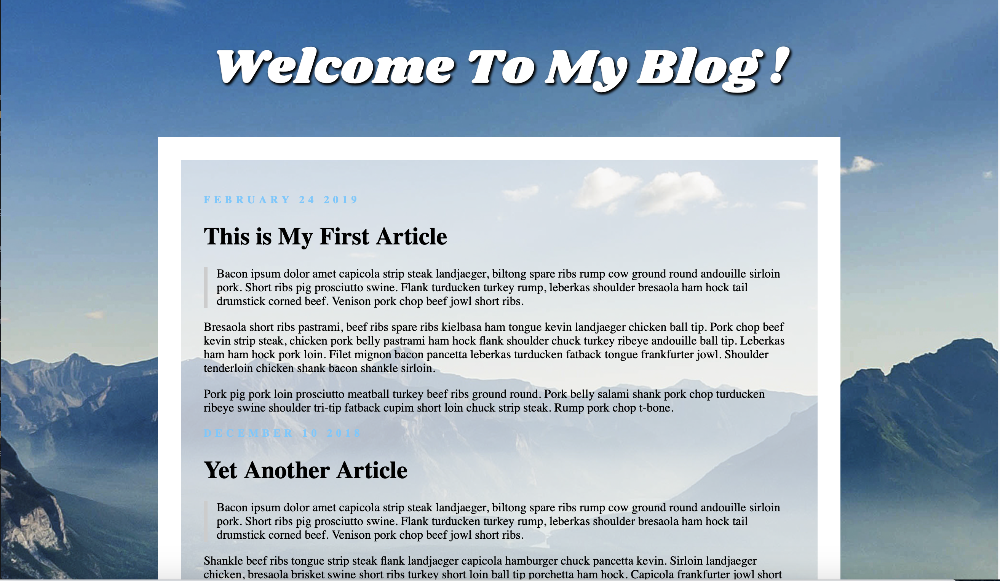
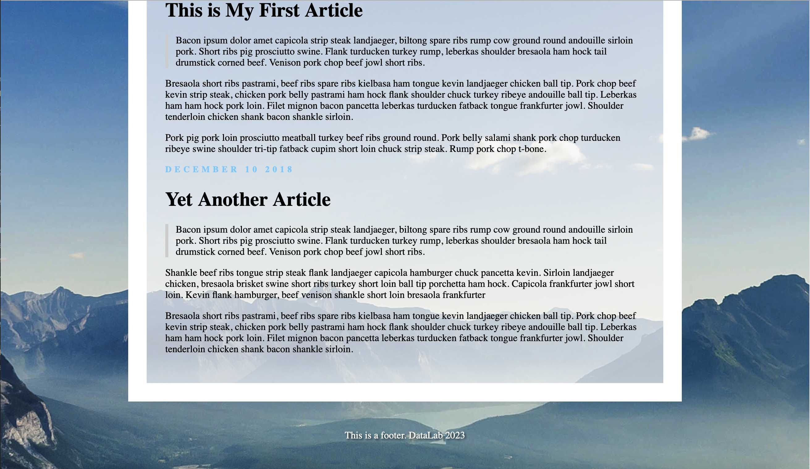
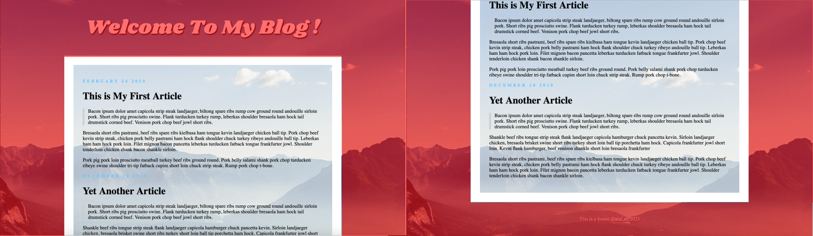
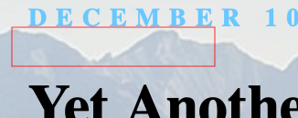
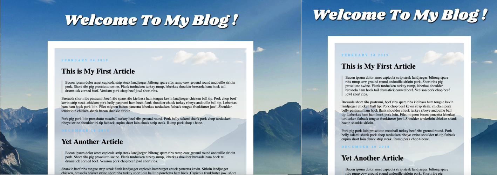
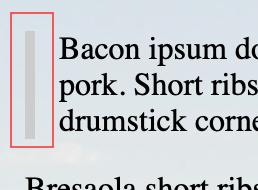

# HW 1 - My First Blog
  
 

## Grading

#### NOTE. Your blog page need not to be exactly the same with the example.

1. Fixed centered covered Background  
  The background image(red part) doesn't scroll along with the content.  

2. Foreground  
  (1) Transparent foreground  
      Your article should be able to see the background image  
   
  (2) Max-width and responsive width  
      The content of the webpage should be responsive according to the window width  
  

3. Custom Header Font  
    

4. Article   
  (1) Quote  
      The quote should indent with a grey line  
     
  (2) Text decorations for dates and article  
    * the space between date letters  
    * "auto" uppercase for dates  
    * bold title   
     
  (3) Spacing for the dates  
     

5. Text shadow in header and footer  
    

6. Rem-based sizing 
  Increasing font size also increases spaces  

## Submission
Open a new merge request when you finished your quiz.  
The deadline of this assignment is `2023/03/09 17:20`. 

<b>Note</b>: When you open merge request, `Title` should be : {your ID} Submission
